# radio-robot-c Architecture

## Layers

The firmware is organized into five layers. Each layer depends only on layers below it.
No heap allocation occurs in any layer during normal operation.

```
┌─────────────────────────────────────────────────────┐
│  Application Layer  (source/app/)                   │
│  Robot · CommandProcessor · Announcer               │
├─────────────────────────────────────────────────────┤
│  Navigation Layer   (source/nav/)                   │
│  PathFollower · PoseProvider · PurePursuit          │
│  Stanley · OtosPoseProvider · DeadReckoning         │
├─────────────────────────────────────────────────────┤
│  Control Layer      (source/control/)               │
│  MotorController · RatioPidController · Odometry   │
├─────────────────────────────────────────────────────┤
│  HAL Layer          (source/hal/)                   │
│  NezhaV2 · OtosSensor · LineSensor · ColorSensor   │
│  GripperServo · PortIO · SerialPort · Radio         │
├─────────────────────────────────────────────────────┤
│  Types              (source/types/)                 │
│  Config.h · Protocol.h                              │
└─────────────────────────────────────────────────────┘
```

---

## Subsystem Descriptions

### Types (`source/types/`)

**`Config.h`** — Shared plain-old-data structs with no dependencies.
- `CalibParams` — all runtime-tunable K parameters (mmPerDegL/R, kFF, kScaleLF/LB/RF/RB,
  ratioPid gains, adj threshold/gain, trackwidth, turn threshold, done tolerance, etc.)
- `MotorGains` — feed-forward and PI gains for MotorController
- `DriveMode` enum — IDLE | STREAMING | TIMED | DISTANCE | GO_TO

**`Protocol.h`** — Compile-time string constants for command prefixes and reply formats.
No logic; eliminates magic strings throughout CommandProcessor.

---

### HAL Layer (`source/hal/`)

Thin wrappers over CODAL hardware. Each class receives its hardware reference at construction
(dependency injection). No cross-HAL dependencies.

**`NezhaV2`** — Nezha V2 motor driver over I2C.
- `setPwm(leftPct, rightPct)` — raw PWM (-100..100) to M2 (left) and M1 (right)
- `readEncoder(isLeft)` → mm — applies LEFT_FWD_SIGN/RIGHT_FWD_SIGN so forward is always positive
- `resetEncoders()`

**`OtosSensor`** — SparkFun OTOS optical odometry at I2C 0x17.
- Burst I2C read/write for position (REG 0x20) and velocity (REG 0x26)
- Signal processing config, IMU calibration, Kalman reset
- LSB conversions: 1 pos LSB ≈ 0.305 mm; 1 heading LSB ≈ 0.00549°

**`SerialPort`** — Line-buffered 115200-baud serial.
- `readLine(buf, len)` → bool — accumulates bytes; returns true on newline
- `send(msg)`, `sendf(fmt, ...)` — snprintf into stack-local buffer, no heap

**`Radio`** — micro:bit radio, group 10, channel 0, power 7.
- 4-slot ring buffer absorbs burst packets between 20 ms ticks
- `poll(buf, len, isRelayed&)` → bool
- Relay mode: strips `>` prefix inbound, prepends `<` prefix outbound

**`LineSensor`** — 4-channel I2C grayscale sensor at 0x1A.

**`ColorSensor`** — APDS9960-style 16-bit RGBC sensor at 0x39 or 0x43.

**`GripperServo`** — Servo output on P1, 0–180°.

**`PortIO`** — J1–J4 digital and analog GPIO, port-to-pin mapping table.

---

### Control Layer (`source/control/`)

**`RatioPidController`** — Discrete PID with anti-windup integral clamp.
- Public `integral` field — read directly by MotorController for slower-wheel adjustment
- `update(error, dtS)` → float; `reset()`
- Used only by MotorController; not exposed above the control layer

**`MotorController`** — Cumulative-distance ratio PID drive loop.
- `startDriveClean(leftMms, rightMms)` — T/D/G arc commands; hard reset PID state
- `startDrive(leftMms, rightMms)` — S command keepalive; re-seeds encoder snapshot to prevent
  startup spike without discarding accumulated ratio history
- `tick(dt_s)` — reads encoders → cumulative deltas → normalized error → PID correction →
  per-direction FF scale → slower-wheel adjustment → co-clamp → setPwm()
- Public `CalibParams&` reference — K command handlers write gains directly

**`Odometry`** — Dead-reckoning pose from encoder increments.
- `update(dL_mm, dR_mm, trackwidth_mm)` — differential-drive heading integration (float)
- `getPose(x_mm, y_mm, h_cdeg)` / `setPose(...)` / `zero()` — int32_t protocol output

---

### Navigation Layer (`source/nav/`)

**`PoseProvider`** *(pure virtual)* — Decouples pose source from navigation algorithms.
```
virtual void        update()  = 0;
virtual bool        getPose(Pose& out) = 0;
virtual const char* sourceName() const = 0;
```
`Pose` = `{int32_t x_mm, y_mm, h_cdeg; bool valid}`

- **`OtosPoseProvider`** — reads OTOS, converts LSB → mm/centidegrees, tracks staleness
- **`DeadReckoningPoseProvider`** — wraps Odometry; always valid; lowest-fidelity
- *(Future)* **`ExternalCameraPoseProvider`** — pose injected via SI command with staleness timeout

**`PathFollower`** *(pure virtual)* — Decouples path algorithm from command layer.
```
virtual void setPath(const Waypoint* wps, uint8_t count) = 0;
virtual bool compute(const Pose& pose, int16_t& leftMms, int16_t& rightMms) = 0;
virtual void reset() = 0;
virtual bool isFinished() const = 0;
virtual const char* name() const = 0;
```
`Waypoint` = `{int32_t x_mm, y_mm}`. Each concrete follower holds a static `Waypoint _path[32]`
copy — no heap, no lifetime dependency on caller's buffer.

- **`PurePursuitFollower`** — lookahead κ = 2×d_lateral/Lf²; tunable lookahead, trackwidth, base speed, stop dist
- **`StanleyFollower`** — δ = θ_e + atan2(k×e, v_soft+v); tunable k, omega_gain, goal tolerance

---

### Application Layer (`source/app/`)

**`Announcer`** — Emits `DEVICE:<type>:<name>:<hwName>:<serial>` on startup.
Intercepts `HELLO` before CommandProcessor and re-emits the announcement (relay rediscovery).

**`CommandProcessor`** — Protocol state machine and command dispatcher.
- Drive mode state machine: IDLE / STREAMING / TIMED / DISTANCE / GO_TO
- Command dispatch via fixed `CmdEntry {prefix, handler*}` table (~35 entries, linear scan)
- S-mode watchdog: 200 ms timeout → fullStop() + emit `LOG:SAFETY_STOP`
- Streaming reports every `encReportEvery` ticks: ENC, SO, CS, LS
- Optional peripherals injected via `init()` as nullable pointers (OtosSensor*, LineSensor*, etc.) — robot works without any optional peripheral
- G go-to command: `computeArc()` pure function + two-phase state machine in tick()

**`Robot`** — Top-level composer. Owns all subsystem instances as static members (no heap).
Controls initialization order (I2C → sensors → motor → command → serial → radio → announcer).
`run()` loop: drain serial → drain radio → `cmd.tick()` → `uBit.sleep(tickMs)`.

---

## Dependency and Ownership Diagram

```mermaid
graph TD
    main["main.cpp"]

    subgraph app["Application Layer"]
        Robot
        CommandProcessor["CommandProcessor\n(35+ commands, drive FSM)"]
        Announcer
    end

    subgraph nav["Navigation Layer"]
        PathFollower["PathFollower\n«interface»"]
        PoseProvider["PoseProvider\n«interface»"]
        PurePursuit["PurePursuitFollower"]
        Stanley["StanleyFollower"]
        OtosPP["OtosPoseProvider"]
        DeadReck["DeadReckoningPoseProvider"]
    end

    subgraph control["Control Layer"]
        MotorController
        RatioPID["RatioPidController"]
        Odometry
    end

    subgraph hal["HAL Layer"]
        NezhaV2
        OtosSensor
        LineSensor
        ColorSensor
        GripperServo
        PortIO
        SerialPort
        Radio
    end

    subgraph types["Types"]
        Config["Config.h\nCalibParams · DriveMode"]
        Protocol["Protocol.h\ncommand strings"]
    end

    %% Composition from main
    main --> Robot
    Robot --> CommandProcessor
    Robot --> Announcer
    Robot --> MotorController
    Robot --> Odometry
    Robot --> SerialPort
    Robot --> Radio
    Robot --> NezhaV2
    Robot --> OtosSensor
    Robot --> LineSensor
    Robot --> ColorSensor
    Robot --> GripperServo
    Robot --> PortIO
    Robot --> PathFollower
    Robot --> PoseProvider

    %% CommandProcessor uses (injected, not owned)
    CommandProcessor --> MotorController
    CommandProcessor --> Odometry
    CommandProcessor -.->|optional| OtosSensor
    CommandProcessor -.->|optional| LineSensor
    CommandProcessor -.->|optional| ColorSensor
    CommandProcessor -.->|optional| GripperServo
    CommandProcessor -.->|optional| PortIO
    CommandProcessor --> PathFollower

    %% Control layer
    MotorController --> NezhaV2
    MotorController --> RatioPID
    OtosPP --> OtosSensor
    DeadReck --> Odometry

    %% Interface implementations
    PurePursuit -->|implements| PathFollower
    Stanley -->|implements| PathFollower
    OtosPP -->|implements| PoseProvider
    DeadReck -->|implements| PoseProvider

    %% Types used everywhere (omitted for clarity except key links)
    CommandProcessor --> Config
    MotorController --> Config
```



---

## Key Design Constraints

| Constraint | Rationale |
|---|---|
| No heap allocation in hot path | CODAL nRF52833, 128 KB RAM; predictable timing |
| All instances static in `Robot` | Controlled init order; no static-init-order fiasco |
| Virtual dispatch only in nav layer | `MotorController::tick()` is hot; PathFollower::compute() is not |
| `ReplyFn` = `void(*)(const char*, void*)` | No `std::function`; no heap for closures |
| OTOS injected as nullable pointer | Robot works without OTOS; optional peripherals use null-check |
| PathFollower copies waypoints (MAX=32) | No lifetime dependency on caller buffer; 256 bytes/follower static cost |
| `uBit.sleep(tickMs)` not busy-wait | Yields fiber so CODAL radio event handler runs between ticks |
| Integrators survive S-command keepalive | `resetIntegrators()` on mode change only; no step response on re-send |
